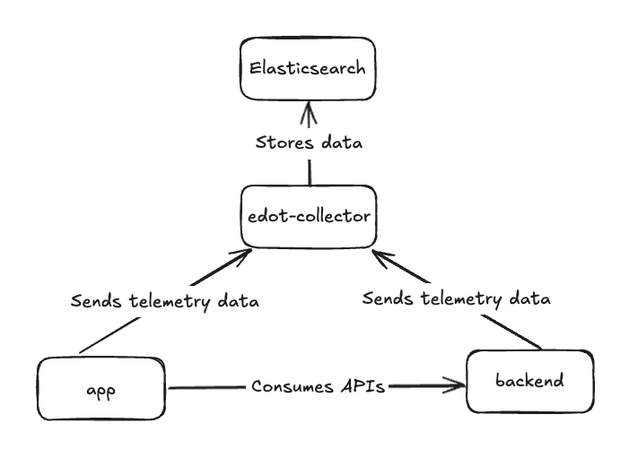

# Demo application

This is a demo Android application to show how the [EDOT Android agent](https://github.com/elastic/apm-agent-android) works.

To showcase an end-to-end scenario including distributed tracing we'll instrument this demo
weather application that comprises two Android UI fragments and a simple local backend
service based on Spring Boot.

- [Components](#components)
  * [Backend service](#backend-service)
  * [Android application](#android-application)
- [How to run](#how-to-run)
  * [Prerequisites](#prerequisites)
  * [Step 1: Setting up Elasticsearch, Kibana and the EDOT Collector](#step-1-setting-up-elasticsearch-kibana-and-the-edot-collector)
  * [Step 2: Launching the backend service](#step-2-launching-the-backend-service)
  * [Step 3: Launch the Android application](#step-3-launch-the-android-application)
- [Analyzing the data](#analyzing-the-data)

## Components



### Backend service

Located in the [backend](backend) module. This is a simple local backend service based on Spring
Boot that provides APIs for the application and helps showcasing the
the [distributed tracing](https://www.elastic.co/docs/reference/opentelemetry/edot-sdks/android#distributed-tracing)
use case.

### Android application

Located in the [app](app) module. The first screen will have a dropdown list with some city names
and also a button that takes you to the second one, where you'll see the selected city's current
temperature. If you pick a non-European city on the first screen, you'll get an error from the
(local) backend when you head to the second screen. This is to demonstrate how network and backend
errors are captured and correlated.

## How to run

### Prerequisites

* Java 17 or higher.
* [Docker](https://www.docker.com/).
* An [Android emulator](https://developer.android.com/studio/run/emulator#get-started).
* On Microsoft Windows
  use [Windows Subsystem for Linux (WSL)](https://learn.microsoft.com/en-us/windows/wsl/install).

> [!NOTE]
> The reason why is recommended using an emulator is because the
> endpoints set [here](app/src/main/java/co/elastic/otel/android/demo/MyApp.kt) and
> [here](app/src/main/java/co/elastic/otel/android/demo/network/WeatherRestManager.kt) point to
> local services via the emulator's localhost IP ([10.0.2.2](https://developer.android.com/studio/run/emulator-networking#networkaddresses)).
> If you wanted to use a real device, you'd need to replace the `10.0.2.2` host by the one of the
> machine where you'll start the services mentioned in the steps below.

### Step 1: Setting up Elasticsearch, Kibana and the EDOT Collector

We use [start-local](https://github.com/elastic/start-local/) to spin up Elasticsearch, Kibana and
the EDOT Collector locally with a single command. Run the following:

```shell
curl -fsSL https://elastic.co/start-local | sh -s -- --edot
```

This creates an `elastic-start-local` folder and starts all three services. Once it finishes, the
EDOT Collector endpoint will be `http://localhost:4318`.

You don't need to configure the EDOT Collector endpoint for this demo application, as it has already
been set [here](app/src/main/java/co/elastic/otel/android/demo/MyApp.kt).

You can stop and start the services later with the scripts in the `elastic-start-local` folder:

```shell
cd elastic-start-local
./stop.sh   # stop the services
./start.sh  # start them again
```

For more information on start-local, refer to
the [start-local documentation](https://github.com/elastic/start-local/).

### Step 2: Launching the backend service

We're going to use the `backend-launcher` script, which will build the backend, package it in a
Docker image and run it connected to the same network as the EDOT Collector.

Once the backend service is running, its endpoint will be `http://localhost:8080/v1/`.

You don't need to set it for this demo application, as it has already been
done [here](app/src/main/java/co/elastic/otel/android/demo/network/WeatherRestManager.kt). So, for
this demo application use case, once the backend service is running, you're ready to go to the
next step.

Execute the [backend-launcher](backend-launcher) script. You can do so by opening up
a terminal, navigating to this directory and running the following command:

```shell
./backend-launcher
```

To stop the backend: `docker rm -f weather-backend`

### Step 3: Launch the Android application

Open up this project with Android Studio
and [run the application](https://developer.android.com/studio/run) in
an Android Emulator. Once everything is running, navigate around in the app to generate
some load that we would like to observe in Elastic APM. So, select a city, click Next and repeat it
multiple times. Please, also make sure to select New York at least once. You will see that the
weather forecast won't work for New York as the city.

## Analyzing the data

After launching the app and navigating through it, you should be able to start seeing telemetry data
coming into your configured Kibana instance. For a more detailed overview, take a look at how
to [Visualize telemetry](https://www.elastic.co/docs/reference/opentelemetry/edot-sdks/android/getting-started#visualize-telemetry)
in the docs.
